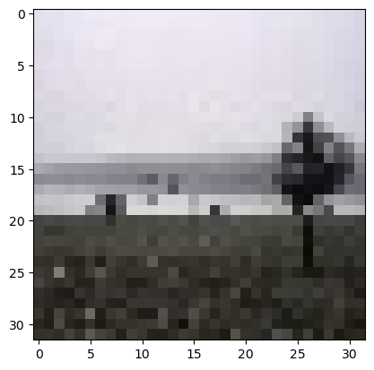

# SRGAN

## This is my implementation of SRGAN to upscale 32x32 images to 128x128 with perceptual loss function

## Sample Results

<!--    -->

### Example 1

  <figure>
    
    <figcaption>Low Resolution Input</figcaption>
  </figure>
  
  <figure>
     
    <figcaption>Prediction</figcaption>
  </figure>
  
  <figure>
    
    <figcaption>Groundtruth High Resolution</figcaption>
  </figure>

### Example 2

  <figure>
    
    <figcaption>Low Resolution Input</figcaption>
  </figure>
  
  <figure>
     
    <figcaption>Prediction</figcaption>
  </figure>
  
  <figure>
    
    <figcaption>Groundtruth High Resolution</figcaption>
  </figure>

## It is visible that the prediction isnt as good as the ground truth but better than the input in terms of resolution. However, the colour consistency isn't being maintained in the predictions